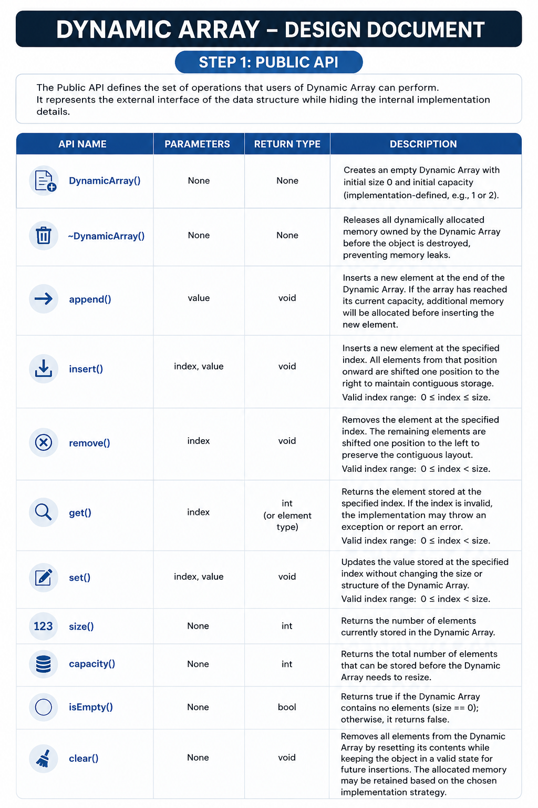
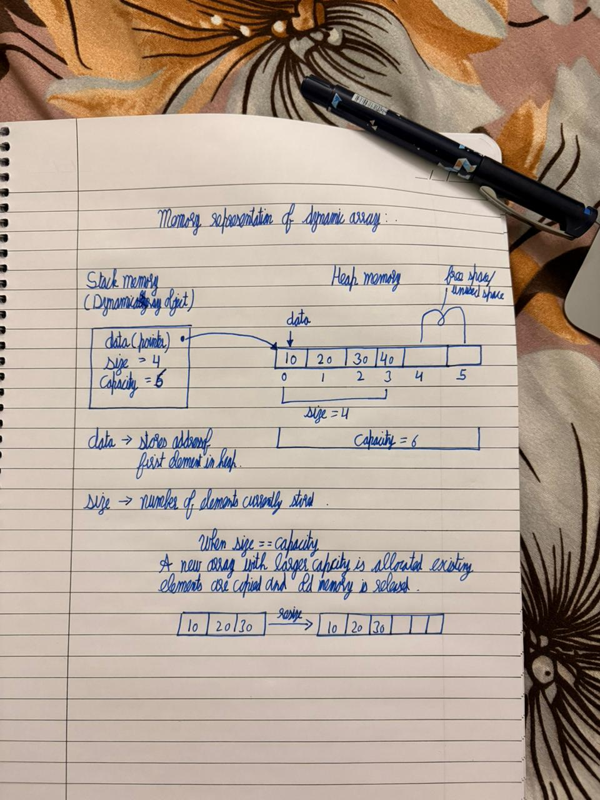
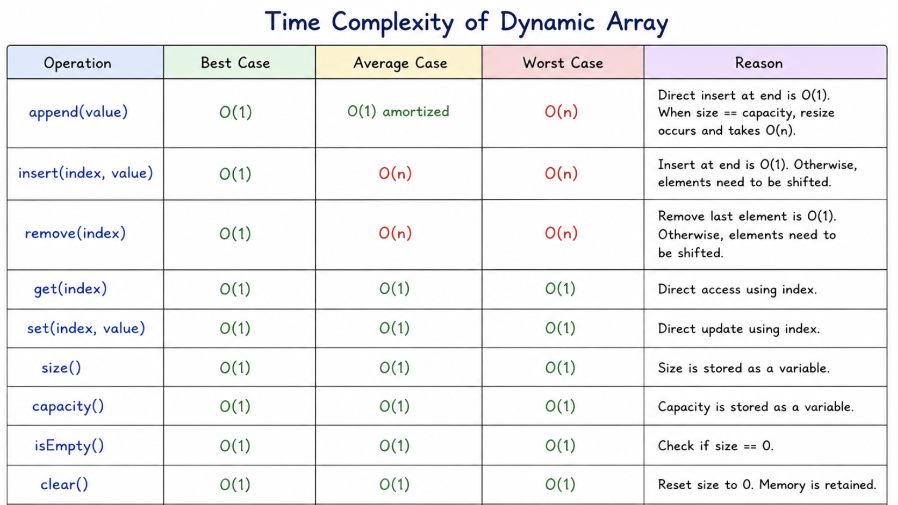

    Dynamic Array
 Objective:-

The objective of designing the Dynamic Array is to build a reusable, memory-efficient, and dynamically resizable container that can store elements in contiguous heap memory. Unlike fixed-size arrays, the Dynamic Array can automatically grow during runtime when more storage is required.
This implementation focuses on understanding manual memory management, dynamic allocation, resizing strategies, object lifetime, and safe memory ownership. The structure will support efficient random access, insertion, deletion, and modification operations while maintaining proper handling of heap memory using the Rule of Three.

    Section 1: Public API

The public API defines the set of operations that users of dynamic array can perform .It represents the external interface of the data structure while hiding the internal implementation details .The API is designed to perform efficient and safe operations for managing dynamically allocated contiguous storage.

All Proposed API are:-
DynamicArray() 
Parameters: None
Return Type: None 
Purpose:Initializes an empty Dynamic Array by allocating initial heap memory and setting the initial size and capacity values.

~DynamicArray() 
Parameters: None
Return Type: None 
Purpose:Releases all dynamically allocated memory owned by the Dynamic Array before the object is destroyed, preventing memory leaks.

DynamicArray(const DynamicArray& other)
Parameters: Reference to another DynamicArray object
Return Type: None
Purpose: Creates a new Dynamic Array object by performing a deep copy of another Dynamic Array. It allocates separate heap memory and copies all elements to avoid shared memory ownership.

DynamicArray& operator=(const DynamicArray& other)
Parameters: Reference to another DynamicArray object
Return Type: DynamicArray&
Purpose: Assigns one Dynamic Array object to another using deep copy. It releases previously owned memory and creates an independent copy of the source object.

append() 
Parameters: value
Return Type: void
Purpose:Inserts a new element at the end of the Dynamic Array. If the array has reached its current capacity, additional memory will be allocated before inserting the new element.

insert() 
Parameters: index, value
Return Type: void
Purpose:Inserts a new element at the specified index. All elements from that position onward are shifted one position to the right to maintain contiguous storage.

remove() 
Parameters: index
Return Type: void
Purpose:Removes the element at the specified index. The remaining elements are shifted one position to the left to preserve the contiguous layout of the Dynamic Array.

get() 
Parameters: index
Return Type: int (or the element type being stored)
Purpose:Returns the element stored at the specified index.

set() 
Parameters: index, value
Return Type: void
Purpose:Updates the value stored at the specified index without changing the size or structure of the Dynamic Array.

size() 
Parameters: None
Return Type: int
Purpose:Returns the number of elements currently stored in the Dynamic Array.

capacity() 
Parameters: None
Return Type: int
Purpose:Returns the total number of elements that can be stored before the Dynamic Array needs to resize.

isEmpty()
Parameters: None
Return Type: bool
Purpose: Returns true if the Dynamic Array contains no elements (size == 0); otherwise, it returns false.

clear()
Parameters: None
Return Type: void
Purpose: Removes all elements from the Dynamic Array by resetting its contents while keeping the object in a valid state for future insertions. The allocated memory may be retained based on the chosen implementation strategy.

In order to conclude this we will using chart that explains in better pictorial and arranged manner 

     API DESIGN JUSTIFICATION

The proposed API has been designed to separate responsibilities into four categories:
Object Lifecycle (Constructor and Destructor)
Data Modification (append, insert, remove, set, clear)
Data Access (get)
State Inspection (size, capacity)
Additional utility methods such as set(), isEmpty(), and clear() have been included to improve usability and readability without increasing the complexity of the implementation.

    Section: 2
Internal Representation:- It describes how dynamical array stores and manages it data internally. It focuses on how the data structure is organized in memory and how memory is managed throughout the lifetime of the object .As we are dealing with dynamic memory our data is stored in contiguous heap memory.Due to increasing nature as size cannot be determined at compile time , memory will be allocated dynamically 

We maintain three private members:
Data member: data
Type: Pointer to the element type 
Purpose: The data pointer stores the address of the first element of the dynamically allocated array. It provides access to the contiguous block of heap memory where all element are stored.

Data member :size
Type: Integer
Purpose:The size variable keeps track of the number of elements currently stored in the Dynamic Array. It changes whenever elements are inserted or removed.

Data Member: capacity
Type: Integer
Purpose:The capacity variable represents the total number of elements that the currently allocated memory block can hold before a resize operation becomes necessary.

Memory map diagram 

Resize Strategy:
When the Dynamic Array becomes full (size == capacity), a new memory block with larger capacity is allocated. Existing elements are copied into the new block, old memory is released, and the data pointer is updated to point to the new memory location. This allows the Dynamic Array to grow dynamically during runtime.

As well as Rule of three also plays a crucial role here.
Destructor
The destructor is responsible for releasing the heap memory owned by the Dynamic Array when the object is destroyed. This prevents memory leaks.

Copy Constructor
The copy constructor will perform a deep copy by allocating a new memory block and copying all elements from the source object. This ensures that each Dynamic Array owns its own memory.

Copy Assignment Operator
The copy assignment operator will also perform a deep copy. Before copying, it will release any previously allocated memory owned by the destination object to avoid memory leaks. 

            
    Section 3:

Complexity Estimates 

Operation: append()
Best Case: O(1)
Average Case: O(1) amortized
Worst case: O(n)
Reason:Most append operations insert directly at the next available position, which takes O(1). When size becomes equal to capacity, a resize operation is triggered where a larger array is allocated and existing elements are copied, taking O(n). Since resizing occurs rarely due to capacity doubling, the average cost over multiple insertions becomes O(1) amortized.

Operation: insert()
Best Case: O(1)
Average Case: O(n)
Worst case: O(n)
Reason:Insertion at the end without resizing is constant time. Otherwise, elements after the insertion point must be shifted.

Operation: remove()
Best Case: O(1)
Average Case: O(n)
Worst case: O(n)
Reason:Removing the last element is constant time. Removing from the beginning or middle requires shifting subsequent elements.

Operation: get()
Best Case: O(1)
Average Case: O(1) 
Worst case: O(1)
Reason:Direct indexing computes the memory location immediately without traversing the array.

Operation: set()
Best Case: O(1)
Average Case: O(1) 
Worst case: O(1)
Reason:Directly updates the value at a given index.

Operation: size()
Best Case: O(1)
Average Case: O(1) 
Worst case: O(1)
Reason:The current size is stored as a member variable.

Operation: capacity()
Best Case: O(1)
Average Case: O(1) 
Worst case: O(1)
Reason:The current capacity is stored as a member variable.

Operation: isEmpty()
Best Case: O(1)
Average Case: O(1)
Worst Case: O(1)
Reason: It only compares the stored size value with zero.

Operation: clear()
Best Case: O(1)
Average Case: O(1)
Worst Case: O(1)
Reason: It resets the size counter while keeping allocated memory available for future use.

 In order to conclude all values of time complexity this chart has been shown below 
 

    Section 4: Design Decisions

Design Decision 1: Contiguous Memory Storage
Selected Design:-
The Dynamic Array stores all elements in a contiguous block of heap memory.
Reason:-
Contiguous storage allows direct indexing of elements, making random access efficient. It also improves cache locality, resulting in better overall performance during sequential traversal.

Alternative Considered
Linked storage using nodes.
Why Rejected
Linked storage requires pointer traversal to access elements, resulting in O(n) random access. Since one of the primary goals of the Dynamic Array is fast indexing, linked storage was rejected.

Design Decision 2: Dynamic Heap Allocation
Selected Design:-
The Dynamic Array allocates memory dynamically on the heap instead of using fixed-size stack memory.
Reason:-
The number of elements that the container must store is not known during compilation. Heap allocation allows the container to grow as new elements are inserted.

Alternative Considered
Fixed-size stack array.
Why Rejected
A stack array has a fixed size that cannot be changed during program execution. Once full, no additional elements can be inserted without creating another array.

Design Decision 3: Automatic Resizing
Selected Design:-Whenever the array reaches its maximum capacity, a larger memory block is allocated automatically and the existing elements are copied into the new block.
Reason:-Automatic resizing allows the Dynamic Array to continue accepting new elements without requiring intervention from the user.

Alternative Considered
Fixed capacity with overflow errors.
Why Rejected:
Requiring users to manually manage capacity makes the data structure less reusable and more difficult to use in real-world applications.

Design Decision 4: Capacity Doubling Strategy
Selected Design:-
Whenever resizing is required, the capacity of the array will be doubled.
Reason:-
Doubling the capacity minimizes the number of reallocations and provides an amortized time complexity of O(1) for append operations.

Alternative Considered
Increase capacity by one element.
Increase capacity by a fixed constant.
Increase capacity by 50%.
Why Rejected
Increasing capacity by one or by a fixed constant results in frequent reallocations and unnecessary copying of elements. Although a 50% growth strategy is more memory-efficient, doubling provides a simpler implementation and stronger performance guarantees for this project.

Design Decision 5: Deep Copy
Selected Design:-
The Dynamic Array will implement deep copying through the copy constructor and copy assignment operator.
Reason:-
Each object should own its own independent block of memory. Deep copying prevents shared ownership and ensures that destroying one object does not affect another.

Alternative Considered
Shallow copy.
Why Rejected
A shallow copy duplicates only the pointer value, causing multiple objects to reference the same memory block. This can lead to dangling pointers, double deletion, and undefined behavior.

Design Decision 6: Separate Size and Capacity Variables
Selected Design:The Dynamic Array maintains separate variables for size and capacity.
Reason:-The size represents the number of valid elements currently stored, while capacity represents the total allocated storage. Keeping these values separate allows the implementation to determine when resizing is necessary.

Alternative Considered
Store only the current size.
Why Rejected:-Without tracking capacity, the container would not know whether additional memory allocation is required before inserting new elements.

Design decision 7:
Error Handling Strategy

The Dynamic Array will perform boundary checking before accessing or modifying elements.
For operations that receive an index:
Valid index range will be checked before execution.
If the index is outside the valid range, the operation will be rejected safely(by throwing exception).
get(index)
If:
index < 0 || index >= size
the access is considered invalid because the requested memory location does not belong to the stored elements.
insert(index,value)
Valid range:
0 <= index <= size
because insertion is allowed at the end position.
remove(index)
Valid range:
0 <= index < size
because only existing elements can be removed.
This prevents:
out-of-bounds memory access
undefined behavior
invalid modification of heap memory