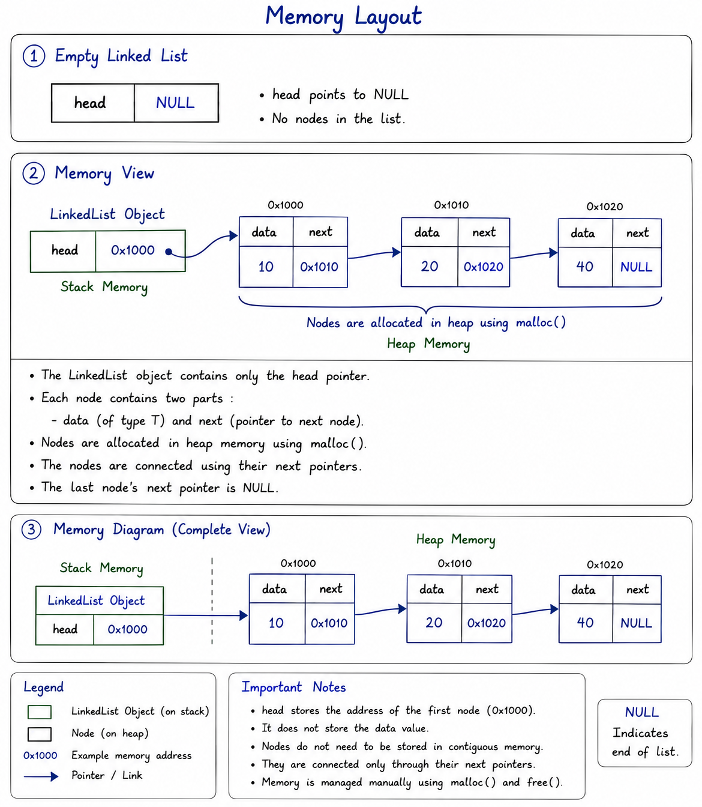

# Phase 0 – Linked List Design Proposal

**Project:** Collections Library (C++)  
**Component:** Linked List  
**Phase:** 0 – Design Proposal  
**Version:** 1.0

---

# Objective

The objective of designing the Linked List is to build a reusable, dynamically allocated linear data structure capable of efficiently storing and managing elements in heap memory. Unlike arrays, a Linked List does not require contiguous memory allocation and can grow dynamically by allocating individual nodes using **malloc()** during runtime and releasing them using **free()**.

This design focuses on understanding pointer manipulation, dynamic memory allocation, object ownership, node relationships, safe memory management, and efficient insertion and deletion operations while maintaining clean software architecture.

The Linked List will serve as the second core component of the Collections Library and will later support more advanced data structures such as HashMap using Separate Chaining.

---

# Section 1 – Public API

## Overview

The Linked List provides a sequential collection of dynamically allocated nodes connected through pointers. Each operation has been carefully selected to satisfy the project requirements while maintaining simplicity and extensibility.

---

## Proposed Public Interface

```cpp
template <typename T>
class LinkedList
{
public:

    // Constructor
    LinkedList();

    // Destructor
    ~LinkedList();

    // Rule of Three
    LinkedList(const LinkedList<T>& other);
    LinkedList<T>& operator=(const LinkedList<T>& other);

    // Insertion
    void insertFront(const T& value);
    void insertBack(const T& value);
    void insertAt(int index, const T& value);

    // Deletion
    void deleteFront();
    void deleteBack();
    void deleteAt(int index);

    // Search
    bool search(const T& value) const;

    // Access
    T get(int index) const;
    void set(int index, const T& value);

    // Utility
    bool isEmpty() const;
    int size() const;
    void clear();
    void print() const;
};
```

---

# Section 2 – Internal Representation

## Selected Design

After evaluating multiple alternatives, the proposed implementation will use a **Singly Linked List**.

Reasons include:

- Lower memory consumption
- Simpler implementation
- Satisfies every project requirement
- Easier debugging
- Better for understanding pointers

---

## Memory Management Policy

All dynamic memory allocations in the Linked List will be performed using the C Standard Library functions **malloc()** and **free()**.

The C++ allocation operators **new** and **delete** will not be used. This ensures consistent manual memory management throughout the Collections Library and aligns with the implementation constraints of the project.

---

## Node Structure

```cpp
template <typename T>
class Node
{
public:

    T data;

    Node<T>* next;
};
```

Each node stores

- Data of type **T**
- Pointer to the next node

---

## Linked List Data Members

```cpp
template <typename T>
class LinkedList
{
private:

    Node<T>* head;

    int length;
};
```

---

## Memory Layout

**Diagram**



---

## Object Ownership

The Linked List object owns every node allocated during runtime.

Every node allocated using **malloc()** becomes the responsibility of the Linked List object and must be released exactly once using **free()**.

Responsibilities include

- Allocating nodes
- Connecting nodes
- Disconnecting nodes
- Destroying nodes
- Preventing memory leaks

---

## Destructor Strategy

Destructor algorithm

1. Start from head.
2. Save the pointer to the next node.
3. Release the current node using **free()**.
4. Move to the next node.
5. Continue until `nullptr`.
6. Reset head.
7. Reset length.

---

## Copy Strategy

The Linked List **will not share nodes**.

Instead,

every copied list receives its own independent nodes.

During copying,

- Allocate new nodes using **malloc()**
- Copy the stored data into the new nodes
- Rebuild the pointer links
- Maintain independent ownership

This prevents

- Double free
- Dangling pointers
- Shared ownership
- Memory corruption

---

# Section 3 – Complexity Analysis

| Operation | Best | Average | Worst | Reason |
|------------|------|----------|--------|--------|
| insertFront() | O(1) | O(1) | O(1) | Only updates head pointer |
| insertBack() | O(n) | O(n) | O(n) | Traverses entire list |
| insertAt() | O(1) | O(n) | O(n) | Best case when inserting at the beginning; otherwise traversal is required |
| deleteFront() | O(1) | O(1) | O(1) | Removes first node |
| deleteBack() | O(n) | O(n) | O(n) | Must locate previous node |
| deleteAt() | O(1) | O(n) | O(n) | Best case when deleting the first node; otherwise traversal is required |
| search() | O(1) | O(n) | O(n) | Best case when value is found at the head; otherwise sequential traversal |
| get() | O(1) | O(n) | O(n) | Best case for index 0; otherwise requires traversal |
| set() | O(1) | O(n) | O(n) | Best case for index 0; otherwise requires traversal |
| size() | O(1) | O(1) | O(1) | Maintained using length variable |
| isEmpty() | O(1) | O(1) | O(1) | Checks length |
| clear() | O(n) | O(n) | O(n) | Releases every allocated node | print() | O(n) | O(n) | O(n) | Visits every node to display all stored element in sequence |

---

# Section 4 – Design Decisions

## Decision 1

### Singly Linked List instead of Doubly Linked List

**Chosen because**

- Less memory usage
- One pointer per node
- Easier implementation
- Meets all assignment requirements

---

## Decision 2

### Maintain Length Variable

Maintaining an internal node count allows

- O(1) size()
- Easier boundary validation
- Better API performance

---

## Decision 3

### Dynamic Allocation

Every node will be allocated individually using

```cpp
malloc()
```

and released using

```cpp
free()
```

Using **malloc()** and **free()** provides explicit control over heap memory while reinforcing manual memory management concepts such as allocation, ownership, and deallocation. This strategy aligns with the implementation constraints of the project.

---

## Decision 4

### Deep Copy

Every Linked List object owns its own memory.

Copying creates

- New nodes allocated using **malloc()**
- Independent memory
- Independent ownership

This avoids

- Double free
- Dangling pointers
- Shared ownership

---

## Decision 5

### Error Handling

Boundary conditions will be checked before every indexed operation.

Invalid indices will not modify the data structure.

The final error handling strategy will be documented during implementation.

---

## Decision 6

### Generic Design Using Templates

The Linked List will be implemented as a template class rather than restricting it to a single data type.

Chosen because

- Increases reusability
- Stores any user-defined or primitive type
- Eliminates duplicate implementations for different data types
- Makes the Collections Library consistent with the Dynamic Array and future HashMap

---